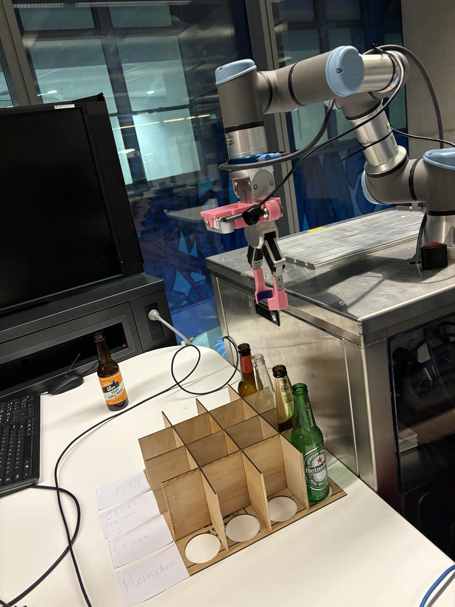
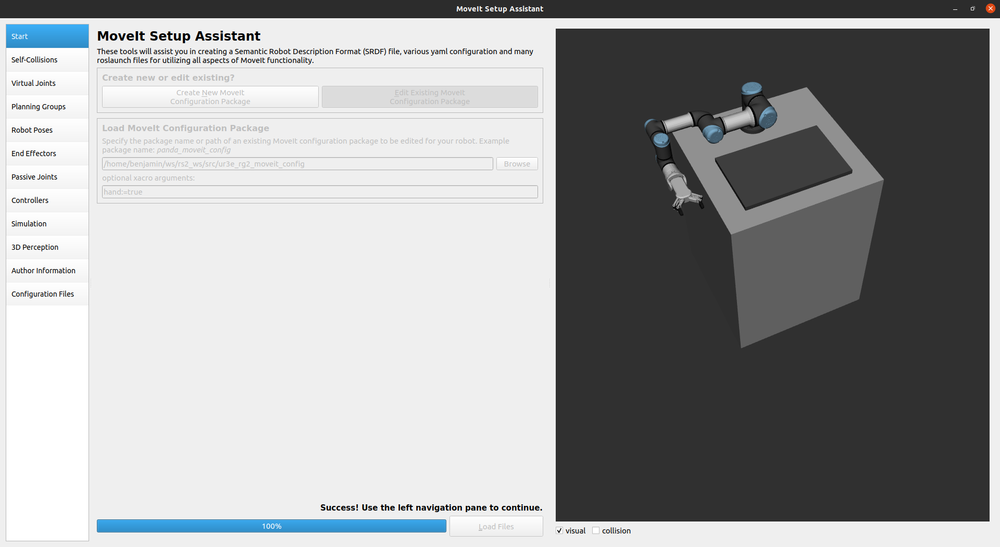

# What drink would you like?

## Problem Statement

Bottle sorting is a labourious task that involves:
- Detecting bottles inside a crate.
- Picking bottles up, one by one.
- Classify them by brand.
- Place them into respective crates for classification.

Given the assumption the that the crates of mixed bottles are moved by a conveyour belt, 
our team ideated an automated picking process that will handle this pipeline in a fully autonomous manner. 

## Project Proposal
We aim to solve the problems by a pipeline of three main components that happen in sequence:
- Bottle Detection and Localisation of bottles in the create from the top-down angle. The detection is
enhanced by an LSTM model to provide time-series information between different frame of detection
- Manipulation for picking and facilitating view for classification.
- Classification into different brands.

The software stack includes two top-level models, please follow each link for more details:
- [`Perception`](perception/README.md)
- [`Manipulation`](manipulation)


## Bring-up
### System setup requirement
This package is an integration of Moveit! planning framework to control an UR3 robot and YOLO V8 model

#### Hardware
Beside the robot UR3e with OnRobot RG2 gripper, the system requires additional hardware modification and sensors setup perception system.
Here is an image of an example setup around the robot on a custom trolley.

<p align="center">
  
</p>


#### Moveit! and YOLO setup
For planning module, a custom Moveit! configuration package are created with the consideration for the trolley and gripper with camera mounted on it. Using the setup assistance from Moveit! allow us to seemlessly account for the collision object relatively on robot body for collision avoidance feature of Moveit!. A custom URDF also need to be defined based on URDF available from each component description package (if available) and manually measured one. With this custom Moveit! configuration file we built and addtional workspace constraint we set, UR3e with RG2 gripper are able to consider the bottle picked along with the gripper for collision-free trajectory planning for bottle pick and place mission.

<p align="center">
    
</p>


##### Other requirement dependencies
 - OpenCV
 - Ultralytics
 - pymodbus==2.5.3

##### ROS installation
For installation, please follow the instruction the snippet below 
```shell
mkdir -p ~/ros_ws/src
cd ~/ros_ws/src 

# clone standard package for ur robot, onrobot gripper and realsense camera driver 
git clone https://github.com/UniversalRobots/Universal_Robots_ROS_Driver.git
git clone -b $ROS_DISTRO-devel https://github.com/ros-industrial/universal_robot.git

git clone https://github.com/takuya-ki/onrobot.git --depth 1
git clone https://github.com/roboticsgroup/roboticsgroup_upatras_gazebo_plugins.git --depth 1

sudo apt-get install ros-$ROS_DISTRO-realsense2-camera

# clone custom Moveit! config package
git clone https://github.com/minhtugonnabelit/ur3e_rg2_moveit_config.git

# clone this package to your workspace
git clone https://github.com/minhtugonnabelit/wdwyl_ros1.git

# install all required dependency for this package
sudo rosdep install --from-paths ./src --ignore-packages-from-source --rosdistro noetic -y --os=ubuntu:focal -y

# build
cd ../
catkin build
```

Run this line to start necessary driver for robot, gripper and camera on the master machine. 
```shell
roslaunch wdwyl_ros1 ur3e_rg2_bringup.launch robot_ip:=<your_robot_ip> gripper:=<you_gripper_type> ip:=<your_gripper_ip> 
```

To start the automated sorting example, run the line below
```shell
rosrun wdwyl_ros1 ur3e_control_node.py
```


