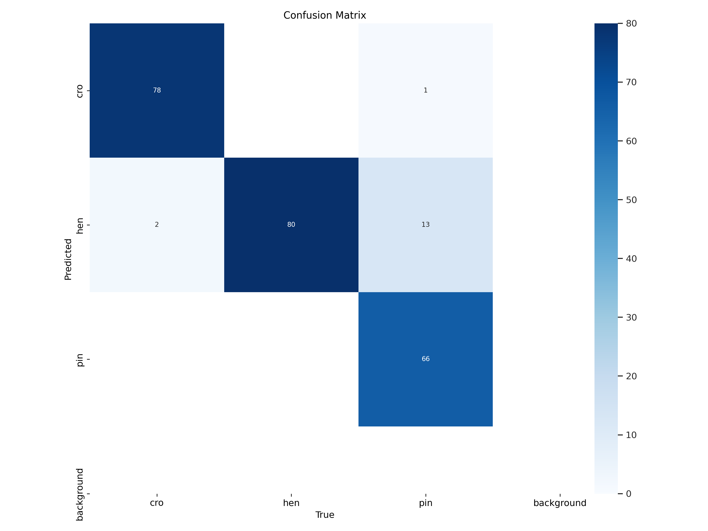

# Perception Module

### Detection and Localisation [link](detection/README.md)

### LSTM [link](lstm/README.md)
LSTM model is developed to enhance the performance of detection

### Classification
There are three attempts by each member to perform the task of bottle classification:
- ResNet [link](brand_classification)
- YOLOv8 with 4 classes [link](classification_2)
- YOLOv8 with 3 classes [link](https://github.com/minhquanvu0604/bottle-classification-YOLOv8)

  

